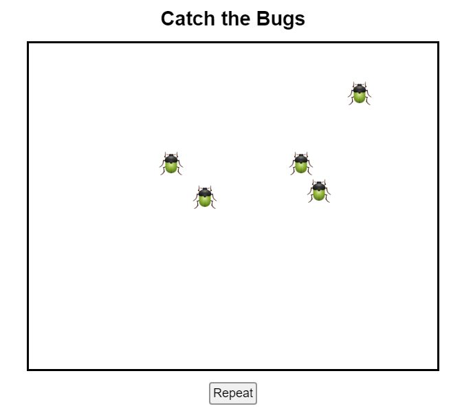
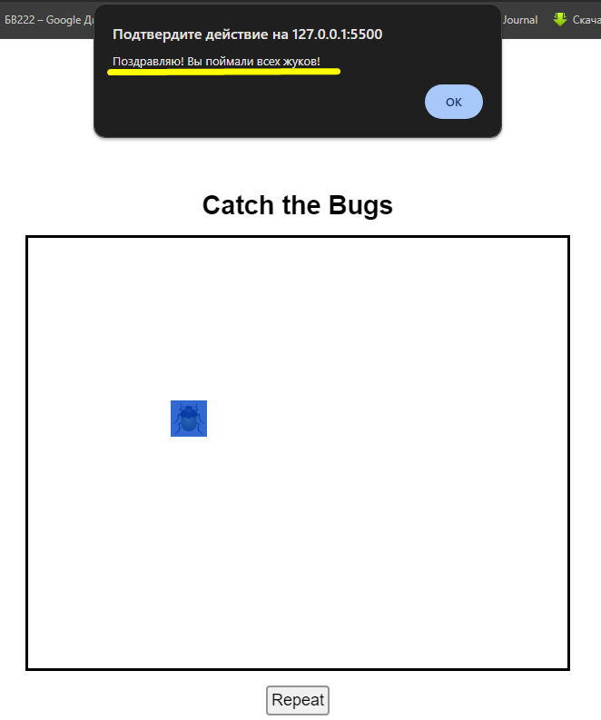
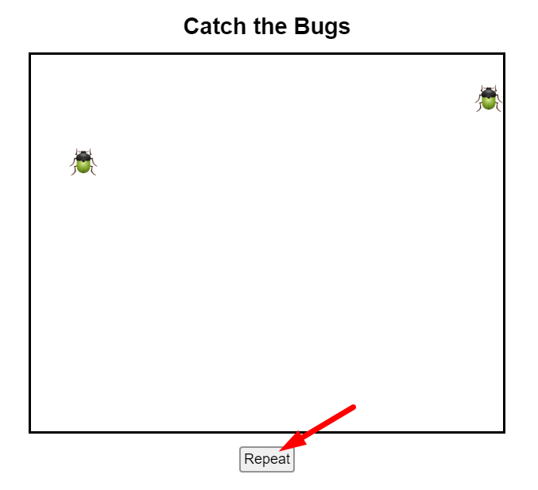

<h1 align="center">Игра «Catch the Bugs»</h1>

Перед Вами игровое поле. По нему перемещаются пять жуков. Ваша задача поймать всех жуков.

<h2>Правила:</h2>

Поймать жука можно щелчком по нему левой кнопки мышки.

Пойманный жук пропадает с поля.

Как только все жуки будут пойманы, Вы получите сообщение с поздравлением!

<h3><b><i>Внимание! Вы можете начать игру заново в любой момент нажав на кнопку Repeat.</i></b></h3>

<h2>УДАЧИ!</h2>